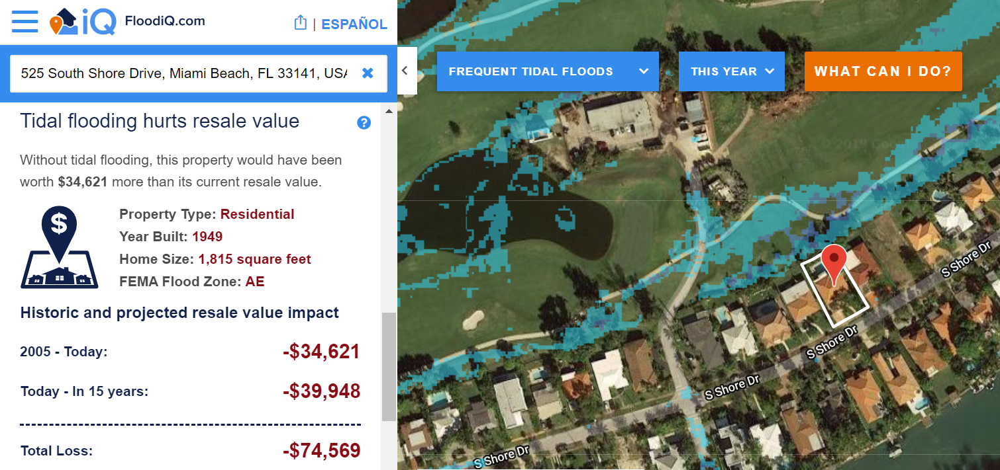

class: left, top
background-image: url(images/roadmap.png)
background-size: 100%
background-position: 50% 280%


```{r packages, message = FALSE, warning = FALSE, echo=FALSE}
# Load packages.
packages <- c("tidyr", 
              "dplyr",
              "stringr",
              "purrr", 
              "data.table", 
              "maps",
              "tree",
              "knitr",
              "ggplot2",
              "gridExtra",
              "rgdal",
              "tmap",
              "leaflet"
              )
packages <- lapply(packages, FUN = function(x) {
  if(!require(x, character.only = TRUE)) {
    install.packages(x)
  library(x, character.only = TRUE)
  }
}
)
```

```{r setup, include=FALSE}
library("knitr")
knitr::opts_chunk$set(echo = TRUE, eval=TRUE, 
                      message=FALSE, warning = FALSE,
                      fig.height=5, fig.width=9, cache = TRUE, cache.lazy = FALSE) 
options(htmltools.dir.version = FALSE)
```  

```{r theme-map, include=FALSE}
theme_simplemap <- function(base_size = 9, base_family = "") {
  theme_bw(base_size = base_size, base_family = base_family) %+replace%
    theme(axis.line = element_blank(),
          axis.text = element_blank(),
          axis.ticks = element_blank(),
          axis.title = element_blank(),
          panel.background = element_blank(),
          panel.border = element_blank(),
          panel.grid = element_blank(),
          panel.spacing = unit(0, "lines"),
          plot.background = element_blank(),
          legend.position = "none")
}
```  
##Simple AB Test
You own a vacation house in Florida. One day you are surprised to find its market value drops. Two people explain to you in seperate ways.

 - "Your home suffers from high risk from frequent tidal flooding."
 - "Your home would have worth $751,176, now it only worth $736,230 due to frequent tidal flooding."
 
Which one seems more convincing?

--

---
## Executive summary
Objective
 - Quantify the impact through machine learning to address the concern to the financial risk of tidal flooding
 
Data
 - The attributes and historical transaction information of all properties (>3 million) in South Florida
 
Methodology
 - Automize the selection, transformation of features
 - Build seperate models within each city and county to account for geographical variation and improve data quality
 - Try random forest and gradient boosting as comparison for trial models

Findings
 - Random forest algorithm consistently outperform gradient boosting
 - City-level models have varying performance and higher potential
 - Ability to predict within 10% deviation in some cities
 - Key filtering parameters are optimized to improve prediction
 - Transaction time and building area is 2 primary factors of property value
 
---
## Roadmap

0. Data science solution to the flooding risk concern
1. Data preparation
2. Exploratory analysis
3. Seperate modeling: one model for each city/county data
4. Feature selection with individual models
5. Interactivity to check individual properties within sample
6. Build predictive models for individual subgroups
7. Test between random forest and gradient boosting
8. Personalize filtering parameters for random forest
9. Iteration through cities/counties and view corss-validated model performance
10. Map county-level model performance

*Codes are partially displayed. For full code I recommend to go to rmd file.

---
## 0. Data science solution to the flooding risk concern

Target audience: Costal homeowners

Pain point: Costal properties are highly valuable but also extremely vulnerable to climate change, especially flooding risk
 - "All of my money right now is in my home."
 - "I doubt we will continue to have this property in the future. (For our children)  - It's just determining the right time to sell."

Data Science Solution: Quantify the impact by calculating financial loss
 - Target variable: The market value of a property
 - Supervised learning
 - A regression problem

---

## 1. Data preparation
Select relevant features from raw data, which comes from a real estate broker's data base. I'm asked to keep confidentiality about raw data so no original data table will be displayed.
```{r, echo=FALSE, eval=FALSE, warning=FALSE}
#Input original data
home_dta_original<-fread("D:/raw_data/SF_Home_Characteristics.csv") #This is original ATTOM data
```

```{r, eval=FALSE, warning=FALSE}
#Select features to import
home_dta<-select(home_dta_original,
                 attomid,#Matching ID
                 deedlastsaleprice,#Transaction price last sale
                 situsstatecode,#State code
                 situscounty,#County code
                 propertyaddresscity,#City code
                 ownertypedescription1,#First owner is individual/company?
                 ownertypedescription2,#Second owner is individual/company?
                 deedlastsaledate,#Date of market sale
                 yearbuilt,#Year when built
                 propertyusegroup,#Commercial/residential?
                 areabuilding,#Living area in sq.feet
                 censustract,#Census tract division
                 propertylatitude,#Lat of property
                 propertylongitude,#Lon of property
                 roomsatticflag,#See below
                 parkinggarage:communityrecroomflag#A series variable measuring physical attributes of the property, including rooms count and relevant facilities
                 )
save(home_dta,file = "D:/Langyi/Taxassessor_reduced.RData")
```

```{r, echo=FALSE, warning=FALSE}
home_data<-load("D:/Langyi/Taxassessor_reduced.RData")
#Store a stage version of data here
report.dim<-function(dta){
  cat("Up to here, the data dimension is",
    dim(dta)[1],
    "*",
    dim(dta)[2]
    )
}
home_dta_ver1<-home_dta
home_dta_ver1%>%report.dim()
```

---
## 1. Data preparation
Recoding and transforming features, mostly to kick out less meaningful factor levels and values miscoded
```{r, echo=TRUE, warning=FALSE}
#This chunk of recoding is not supposed to change data dimension
#Fill in the price variable so that it will not be dropped later
home_dta$deedlastsaleprice[is.na(home_dta$deedlastsaleprice)=="TRUE"]<-0
#Rounding deed last sale date to year and recoding NAs
home_dta$deedlastsaledate<-str_sub(home_dta$deedlastsaledate,start = 0,end = 4)%>%
  as.numeric()
home_dta$deedlastsaledate[home_dta$deedlastsaledate==""]<-NA
#Make id numeric
home_dta$attomid<-home_dta$attomid%>%as.numeric()
#Recoding ownership type misseallenous to NA
home_dta$ownertypedescription1[home_dta$ownertypedescription1=="NP"]<-NA
home_dta$ownertypedescription1[home_dta$ownertypedescription1=="UNKNOWN"]<-NA
home_dta$ownertypedescription2[home_dta$ownertypedescription1=="NP"]<-NA
home_dta$ownertypedescription2[home_dta$ownertypedescription1=="UNKNOWN"]<-NA
```
---
## 1. Data preparation
Recoding and transforming features (cont'd)
```{r, echo=TRUE, warning=FALSE}
#Recoding property usage group
home_dta$propertyusegroup[home_dta$propertyusegroup=="UNKNOWN"|
                            home_dta$propertyusegroup=="Other"|
                            home_dta$propertyusegroup=="NP"]<-NA
#Note that 152 PropertyUseStandardized is better coded by, should do this in future
class_coding<-read.csv("D:/raw_data/prop_use_codes_trim.csv")
#Excluding <50 sq. feet living area
home_dta$areabuilding[home_dta$areabuilding<50]<-NA
```
---
## 1. Data preparation
Recoding and transforming features (cont'd)
```{r, echo=TRUE, warning=FALSE}
#As tree modeling does not accept character vector, those in the data are recoded to factors.
cat("These variables are recoded to factors")
for (i in names(home_dta)){
  if (class(home_dta[[i]])=="character"){
    print(i)
    home_dta[[i]]<-home_dta[[i]]%>%as.factor()
  }
}
```
---
##1. Data preparation
Recoding and transforming features (cont'd)
```{r, echo=TRUE, warning=FALSE}
#Drop variables with too many levels, besides those are numerical
for (i in names(home_dta)[-1:-14]){
    if ((home_dta[[i]]%>%unique()%>%length()>3)&
        (str_detect(i,pattern = "area|count")==FALSE)
        ){
    print(i)
    home_dta<-home_dta%>%select(-i)
    }
}
#Store a stage version of data here
home_dta_ver2<-home_dta
home_dta_ver2%>%report.dim()
```

---
## 2. Exploratory analysis
Plot summary graph of a few important variables to understand their overall statistical distribution
```{r, echo=TRUE, warning=FALSE}
#Plot summary of a few important variables
summary.numeric<-function(varname="deedlastsaleprice",
                        dta=home_dta){
m<-ggplot(data=dta)+
  geom_area(aes(x = dta[[varname]]),
                 stat = "bin",
            fill = "khaki2"
           )+
  xlab(varname)+
  ylab("Properties")+
  theme_classic()
return(m)
}
summary.categorical<-function(varname="propertyusegroup",
                        dta=home_dta){
m<-ggplot(data=dta)+
  geom_bar(aes(x = dta[[varname]]),
            fill = "khaki2"
           )+
  xlab(varname)+
  ylab("Properties")+
  theme_classic()
return(m)
}
```
---
## 2. Exploratory analysis
We can see some cycles in the date variables, especially around 2008. The main body of property ownership is individual, and most houses are for residential purposes. 

```{r, echo=TRUE, warning=FALSE}
grid.arrange(summary.numeric("deedlastsaledate"),summary.numeric("deedlastsaleprice"),summary.numeric("yearbuilt"),summary.numeric("areabuilding"),summary.categorical("propertyusegroup"),summary.categorical("ownertypedescription1"),summary.categorical("ownertypedescription2"),ncol=2)
```

---
## 2. Exploratory analysis
Summarize a few key variables by county to see the geographical variation
```{r,warning=FALSE,message=FALSE,echo=TRUE}
#Import shape file and save to rdata to reduce loading time
library(rgdal)
parcel<-readOGR(dsn = "D:/Langyi/tl_2017_us_county", layer = "tl_2017_us_county")
counties<-c("Broward","Collier","Hendry","Lee","Miami-Dade","Monroe","Palm Beach")
parcel<-parcel[parcel@data$NAME%in%counties&parcel@data$STATEFP=="12",]
#Summary a few key variables by county
county_summary<-home_dta%>%group_by(situscounty)%>%summarize(n()%>%as.numeric(),
                                                    mean(deedlastsaleprice%>%as.numeric(),na.rm = TRUE),
                                             mean(yearbuilt%>%as.numeric(),na.rm = TRUE),
                                          mean(areabuilding%>%as.numeric(),na.rm = TRUE))
names(county_summary)<-c("NAME","Num_of_Properties","Average_Price","Average_Built_Year","Average_Living_Area")
parcel@data<-inner_join(parcel@data,county_summary,by="NAME")
```

---
## 2. Exploratory analysis
Summarize a few key variables by county (cont'd)
```{r,warning=FALSE,message=FALSE,echo=TRUE}
#Plot statistics by county
library(tmap)
summary.county<-function(varname,par=parcel){
m<-tm_shape(parcel) + 
  tm_fill(varname)+
  tm_text("NAME",size = 0.6)+
  tm_borders()
return(m)
}
```
---
## 2. Exploratory analysis
Summarize a few key variables by county (cont'd)
We can see considerable geographical variation in the map. Miami-dade, Broward and Palm Beach has many big houses, while are relatively old and cheap. On the other hand, counties over the left are having new and expensive houses.

```{r,warning=FALSE,message=FALSE,echo=TRUE}
tmap_arrange(summary.county(varname="Num_of_Properties"),summary.county(varname="Average_Living_Area"),summary.county(varname="Average_Price"),summary.county(varname="Average_Built_Year"),nrow = 2)
```

---
## 3. Seperate modeling: one model for each city/county data
This means for every city/county in South Florida, we fit an individual model to it seperately.

Inspired by the "submarket" idea
 - The housing prices between neibourhoods, cities and counties vary a lot
 
Feature structure vary by county
 - There are some variables that represent housing attributes that miss in data with different cases between counties.

```{r, echo=TRUE, warning=FALSE}
#The city variable is messy, so need to visualize first
city_obs<-group_by(home_dta,propertyaddresscity)%>%summarise(n())
names(city_obs)[1]<-"City"
names(city_obs)[2]<-"Properties"
city_obs<-city_obs%>%filter(city_obs$Properties<20000)
```
---
## 3. Seperate modeling: one model for each city/county data
We can see we need to drop some cities due to too few samples.
```{r, echo=TRUE, warning=FALSE}
ggplot(data=city_obs)+
  geom_area(aes(x = city_obs$Properties),stat = "bin",fill = "khaki2")+
  xlab("Numbers of properties in data")+ylab("Number of cities")+ 
  ggtitle("Most cities have few total number of properties")+theme_classic()
```
---
## 3. Seperate modeling: one model for each city/county data
Drop cities with sample size too small to go into tree model.
```{r, echo=TRUE, warning=FALSE}
#For obtaining sufficient number of obs in each model, we drop cities with <1000 obs.
city_obs<-city_obs[-1,]
city_obs<-city_obs%>%filter(city_obs$Properties>1000)%>%as.data.frame()
city_obs$Properties<-NULL
names(city_obs)[1]<-"propertyaddresscity"
home_dta_less_city<-home_dta%>%inner_join(city_obs,key = "prepertyaddresscity")
#Store a stage version of data here
home_dta_ver3<-home_dta
home_dta_ver3%>%report.dim()
#Split data
home_dta_less_city$propertyaddresscity<-home_dta_less_city$propertyaddresscity%>%as.character()
home_city_dta<-split(home_dta_less_city,home_dta_less_city$propertyaddresscity)
```
---
## 3. Seperate modeling: one model for each city/county data
The process for county-level modeling is rather straightforward.
```{r, echo=TRUE, warning=FALSE}
home_county_dta<-split(select(home_dta,-censustract),home_dta$situscounty)
```

---
## 4. Feature selection with individual models
Build function to automatically drop variables that are not important and are missing over 10% values, as we don't wish too many obs are omitted in tree model due to missing value.
```{r, echo=TRUE, warning=FALSE}
#Function to determine whether a variable is missing less than 10% values
is.missing<-function(var,ratio = 0.1){
    a<-var%>%length()
    b<-var%>%is.na()%>%sum()
    b/a < ratio
}
#Function to preprocess a data frame and drop according to is.missing
#Here some features are kept due to their apparent relevancy which does not worth being dropped due to missing values
drop.missing<-function(dta){
  varnames_important<-names(dta)[1:14]
  varnames_supplement<-names(dta)[-1:-14]
  for (i in varnames_important){
    var<-dta[[i]]
    if (is.missing(var,ratio = 0.5)=="FALSE"){
      dta<-select(dta,-i)
    }
  }
  for (i in varnames_supplement){
    var<-dta[[i]]
    if (is.missing(var,ratio = 0.1)=="FALSE"){
      dta<-select(dta,-i)
    }
  }
  return(dta)
}
```
---
## 4. Feature selection with individual models
Build function to automatically drop variables that have no variation therefore serve for no prediction purpose
```{r, echo=TRUE, warning=FALSE}
#Drop unary variables
drop.unary<-function(dta){
  for (i in names(dta)[-1:-5]){
    var<-dta[[i]]
    var<-var[is.na(var)==FALSE]
    if ((var%>%unique()%>%length()==1)|
        (var%>%unique()%>%length()==0)){
    dta<-dta%>%select(-i)
    }
  }
  return(dta)
}
```

---
## 4. Feature selection with individual models
Apply the 2 selection functions built just now to all subsamples
```{r, echo=TRUE, warning=FALSE}
#Apply to city the function in previous function for feature selection
home_city_cleaned_dta<-purrr::map(home_city_dta,drop.missing)
home_city_cleaned_dta<-purrr::map(home_city_cleaned_dta,drop.unary)
#Apply to county the function in previous function for feature selection
home_county_cleaned_dta<-purrr::map(home_county_dta,drop.missing)
home_county_cleaned_dta<-purrr::map(home_county_cleaned_dta,drop.unary)
```
---
## 5. Interactivity to check individual properties within sample
Build the ability to check for key features of individual properties using Google map
```{r, echo=TRUE, warning=FALSE}
#Provide an interactive leaflet for checking individual properties, Aventura as an example.
map.variable<-function(dta=home_city_cleaned_dta$`AVE MARIA`,
                       varname="propertyusegroup"){
if (varname%in%names(dta)==TRUE&
    "propertylatitude"%in%names(dta)==TRUE&
    "propertylongitude"%in%names(dta)==TRUE){
  dta<-dta[is.na(dta[[varname]])==FALSE,]
library(leaflet)
pal = colorFactor("Set1", dta[[varname]])
color_offsel1 = pal(dta[[varname]])
leaflet(dta) %>%
  addTiles() %>%
  addCircleMarkers(lng = ~propertylongitude, 
             lat = ~propertylatitude,
             color = color_offsel1,
             popup = content<<-str_c(varname,
                                     dta[[varname]],
                                     "Market price",
                                     dta$deedlastsaleprice,
                                     "Transaction date",
                                     dta$deedlastsaledate,
                                     "Living area",
                                     dta$areabuilding,
                                     sep = " "),
             clusterOptions = markerClusterOptions())%>%
  addLegend(pal = pal, values = ~dta[[varname]], title = varname)
} else {print("Variables filtered out in final data, unable to plot map for this subsample")
}
}
```
---
## 5. Interactivity to check individual properties within sample
Build the ability to check for key features of individual properties using Google map
```{r, echo=TRUE, warning=FALSE}
map.variable(dta = home_city_cleaned_dta$AVENTURA)
```

---
## 6. Build predictive models for individual subgroups
Develop functionality for final preprocessing before feeding data into model. Here we want to deal within each model very precisely the control of missing values and division of training/test test. Therefore, the process was distributed to each subsample and run independently.
```{r, echo=TRUE, warning=FALSE}
#Build final preprocess function
model.preprocess<-function(dta,
                           price_high,
                           price_low,
                           start_year,
                           size){
#Delete lng/lat
dta$propertylatitude<-NULL
dta$propertylongitude<-NULL
#Recode tract to factor
  if ("censustract"%in%names(dta)){
    if (dta$censustract%>%unique()%>%length()<32){
      dta$censustract<-dta$censustract%>%as.factor()
    }
    else {
      dta<-dta%>%select(-censustract)
    }
  }
#Exclude NA in y variable
dta<-filter(dta,is.na(dta$deedlastsaleprice)==FALSE)
row_before<-nrow(dta)
#Excluding high value transactions to suppress extreme values for convenience
dta$deedlastsaleprice[dta$deedlastsaleprice>=price_high]<-NA
#Excluding low value transactions which are not authentic
dta$deedlastsaleprice[dta$deedlastsaleprice<=price_low]<-NA
dta$deedlastsaleprice<-dta$deedlastsaleprice%>%
  as.numeric()
#Exclude NA in y variable again
dta<-filter(dta,is.na(dta$deedlastsaleprice)==FALSE)
row_after<-nrow(dta)
retention<<-row_after/row_before
#As past transaction reflect less information, we only pick recent years (after 2012)
if ("deedlastsaledate"%in%names(dta))
dta<-dta%>%filter(deedlastsaledate>=start_year)
#Reduce size for computation convenience
set.seed(0)
  if (nrow(dta)>=size){
    dta<-sample_n(dta,size)
  }
return(dta)
}
```

---
## 6. Build predictive models for individual subgroups
I decided to use random forest and gradient boosting as the first try. Random forest deal with data with large variations well while boosting is good at learn specific models, so they are a good compensation to each other. In addition, tree algorithms always return variable importance, which is useful for subsequent model selection.

Here a model comparison with output from random forest and gradient boosting is built. It will generate several attributes of the model as well as some key performance index of the 2 tree algorithms.

```{r, echo=TRUE, warning=FALSE}
model.comparison<-function(dta,preprocess_retention=retention){
#Split training/test samples (0.7:0.3)
train<-sample_frac(dta,size=0.7)
test<-anti_join(dta,train,by="attomid")
#Prepare y and x features
train<-select(train,
          -attomid,
          -situsstatecode,
          -situscounty,
          -propertyaddresscity)
y<-train$deedlastsaleprice
x<-select(train,
          -deedlastsaleprice)
#Try random forest
library(randomForest)
train_rf <- randomForest(y~.,x,
                         importance = TRUE,
                         na.action = "na.omit"
                         )
rf_summary<-importance(train_rf)%>%as.data.frame()
rf_highvars<-rf_summary[order(rf_summary$`%IncMSE`, 
                 decreasing = TRUE),]%>%head(5)%>%row.names()
if (length(rf_highvars)<5){
  add<-5-length(rf_highvars)
  rf_highvars<-c(rf_highvars,rep(NA,add))
}
#Test set
yhat.rf <- predict(train_rf,test)
rf_MSE<-mean((yhat.rf-test$deedlastsaleprice)^2,na.rm = TRUE)
rf_MPE<-mean((yhat.rf-test$deedlastsaleprice)/test$deedlastsaleprice,na.rm = TRUE)
rf_MAPE<-mean(abs((yhat.rf-test$deedlastsaleprice)/test$deedlastsaleprice),na.rm = TRUE)
#Boosting
library(gbm)
train_gb <- gbm(y~.,x,
                n.trees = 1000,
                    distribution = "gaussian"
)
gb_summary<-summary(train_gb,plotit = FALSE)
gb_highvars<-gb_summary[order(gb_summary$rel.inf, 
                 decreasing = TRUE),]%>%head(5)%>%row.names()
if (length(gb_highvars)<5){
  add<-5-length(gb_highvars)
  gb_highvars<-c(gb_highvars,rep(NA,add))
}
#Test set
yhat.gb <- predict(train_gb,test,n.trees = 1000)
gb_MSE<-mean((yhat.gb-test$deedlastsaleprice)^2,na.rm = TRUE)
gb_MPE<-mean((yhat.gb-test$deedlastsaleprice)/test$deedlastsaleprice,na.rm = TRUE)
gb_MAPE<-mean(abs((yhat.gb-test$deedlastsaleprice)/test$deedlastsaleprice),na.rm = TRUE)
#Store comparison between rf and gb
if (dta$propertyaddresscity%>%unique()%>%length()==1){
  subsample_name<-paste(dta$situsstatecode%>%unique()%>%as.character()%>%paste(collapse ="_"),
                      dta$situscounty%>%unique()%>%as.character()%>%paste(collapse ="_"),
                      dta$propertyaddresscity%>%unique()%>%as.character()%>%paste(collapse ="_"),
                      sep = "_")
} else {
  subsample_name<-paste(dta$situsstatecode%>%unique()%>%as.character()%>%paste(collapse ="_"),
                        dta$situscounty%>%unique()%>%as.character()%>%paste(collapse ="_"))
  
}
comparison<-c(subsample_name,
              preprocess_retention,
              nrow(dta),
              ncol(dta),
              rf_MSE,
              rf_MPE,
              rf_MAPE,
              rf_highvars,
              gb_MSE,
              gb_MPE,
              gb_MAPE,
              gb_highvars)%>%as.data.frame%>%t()
colnames(comparison)<-c("subsample",
                        "preprocess_retention",
                        "obs",
                        "vars",
                        "rf_MSE",
                        "rf_MPE",
                        "rf_MAPE",
                         "rf_1st",
                         "rf_2nd",
                         "rf_3rd",
                         "rf_4th",
                         "rf_5th",
                        "gb_MSE",
                        "gb_MPE",
                        "gb_MAPE",
                         "gb_1st",
                         "gb_2nd",
                         "gb_3rd",
                         "gb_4th",
                         "gb_5th")
return(comparison)
}
a<-model.comparison(home_city_cleaned_dta$`AVE MARIA`%>%model.preprocess(
                   price_high=5000000,
                           price_low=100,
                           start_year =2012,
                           size=500))

```

---
## 6. Build predictive models for individual subgroups
Assembling the final modeling function combining the previous 2 functions and applicable to large list.
```{r, echo=TRUE, warning=FALSE}
#Build function to parse modeling output and realize parameter entry
modeling<-function(list,
                   price_h=5000000,
                           price_l=100,
                           yr_st=2012,
                           sz=500){
comparison_set<-NULL
for (i in 1:length(list)){
  dta<-list[[i]]
  dta_preprocessed<-model.preprocess(dta,
                                     price_high = price_h,
                                     price_low = price_l,
                                     start_year = yr_st,
                                     size = sz)
  comparison<-model.comparison(dta_preprocessed)
  comparison_set<-rbind(comparison_set,comparison)
}
  comparison_set<-cbind(
    rep(price_h,nrow(comparison_set)),
    rep(price_l,nrow(comparison_set)),
    rep(yr_st,nrow(comparison_set)),
    rep(sz,nrow(comparison_set)),
    comparison_set
  )
  comparison_set<-comparison_set%>%as.data.frame()
  names(comparison_set)[1:4]<-c("price_high","price_low","year_start","size")
  comparison_set$preprocess_retention<-comparison_set$preprocess_retention%>%as.character()%>%as.numeric()
  for (i in c("obs",
              "vars",
              "rf_MSE",
              "rf_MPE",
              "rf_MAPE",
              "gb_MSE",
              "gb_MPE",
              "gb_MAPE")){
    comparison_set[[i]]<-comparison_set[[i]]%>%as.character()%>%as.numeric()
              }
  return(comparison_set)
}
```
---
## 7. Test between random forest and gradient boosting
Test in subsample of cities and counties, compare several KPI of models to see which of random forest and gradient boosting does the job better.
```{r, echo=TRUE, warning=FALSE}
model_city<-modeling(home_city_cleaned_dta)
model_county<-modeling(home_county_cleaned_dta)
```

The random forest outperforms boosting in most of the cases, across different measure of prediction accuracy. This is reasonable given our data is quite varying.

```{r, echo=TRUE, warning=FALSE}
cat("In",
    nrow(model_city),
    "city-level subsamples,",
    model_city[model_city$rf_MSE<model_city$gb_MSE,]%>%nrow(),
    "generate better performance measure by MSE with random forest than boosting trees.",
    model_city[model_city$rf_MPE<model_city$gb_MPE,]%>%nrow(),
    "by MPE.",
    model_city[model_city$rf_MAPE<model_city$gb_MAPE,]%>%nrow(),
    "by MAPE."
    )

cat("In",
    nrow(model_county),
    "county-level subsamples,",
    model_county[model_county$rf_MSE<model_county$gb_MSE,]%>%nrow(),
    "generate better performance measure by MSE with random forest than boosting trees.",
    model_county[model_county$rf_MPE<model_county$gb_MPE,]%>%nrow(),
    "by MPE.",
    model_county[model_county$rf_MAPE<model_county$gb_MAPE,]%>%nrow(),
    "by MAPE."
    )
```

## 8. Personalize filtering parameters for random forest
Build plotting function. We want to see if we can control what data we put in, how to do so can help us get best results.
```{r, echo=TRUE, warning=FALSE}
#Build function to plot series of error for a given tuning parameter
error.plot<-function(dta=error_matrix){
retention<-ggplot(data=dta)+
  geom_line(aes(x = Parameter,
                y = Retention),
            color = "tomato1"
           )+
  xlab("Parameter values")+
  theme(legend.position = "left")+
  theme_classic()
mse<-ggplot(data=dta)+
  geom_line(aes(x = Parameter,
                y = MSE),
            color = "tomato2"
           )+
  xlab("Parameter values")+
  theme(legend.position = "left")+
  theme_classic()
mpe<-ggplot(data=dta)+
  geom_line(aes(x = Parameter,
                y = MPE),
            color = "tomato3"
           )+
  xlab("Parameter values")+
  theme(legend.position = "left")+
  theme_classic()
mape<-ggplot(data=dta)+
  geom_line(aes(x = Parameter,
                y = MAPE),
            color = "tomato4"
           )+
  xlab("Parameter values")+
  theme(legend.position = "left")+
  theme_classic()
grid.arrange(retention,mse,mape,mpe)
}
```
---
## 8. Personalize filtering parameters for random forest
Error performance for maximum observation within each model. 
```{r, eval=TRUE, echo=TRUE, warning=FALSE}
error_matrix<-NULL
for (i in c(100,200,300,400,500,600,700)){
output<-modeling(home_county_cleaned_dta,
                      price_h=5000000,
                      price_l=100,
                      sz=i,
                      yr_st=2012)
error_performance<-cbind(i,
                         output$preprocess_retention%>%mean(),
                         output$rf_MSE%>%mean(),
                         output$rf_MPE%>%mean(),
                         output$rf_MAPE%>%mean()
)
error_matrix<-rbind(error_matrix,error_performance)
}
colnames(error_matrix)<-c("Parameter","Retention","MSE","MPE","MAPE")
error_matrix<-error_matrix%>%as.data.frame()
```
---
## 8. Personalize filtering parameters for random forest
This one looks at maximum size of sample in each model. Overall, a larger sample size does help to improve prediction. If not because of computation power constraint, a larger sample should've been used.
```{r, echo=TRUE, warning=FALSE}
error.plot(error_matrix)
```

---
## 8. Personalize filtering parameters for random forest
Error performance for lowest price acceptable for property

```{r, echo=TRUE, warning=FALSE}
error_matrix<-NULL
for (i in c(100,300,500,1000,3000,7000,10000)){
output<-modeling(home_county_cleaned_dta,
                      price_h=5000000,
                      price_l=i,
                      sz=200, 
                      yr_st=2012)
error_performance<-cbind(i,
                         output$preprocess_retention%>%mean(),
                         output$rf_MSE%>%mean(),
                         output$rf_MPE%>%mean(),
                         output$rf_MAPE%>%mean()
)
error_matrix<-rbind(error_matrix,error_performance)
}
colnames(error_matrix)<-c("Parameter","Retention","MSE","MPE","MAPE")
error_matrix<-error_matrix%>%as.data.frame()
```
---
## 8. Personalize filtering parameters for random forest
This one looks at lowest price acceptable for property. We can see there's a tradeoff between having better prediction and having less data.
```{r, echo=TRUE, warning=FALSE}
error.plot(error_matrix)
```

---
## 8. Personalize filtering parameters for random forest
Error performance for starting year to filter the properties
```{r, echo=TRUE, warning=FALSE}
error_matrix<-NULL
for (i in c(2000,2007,2010,2013,2015,2016,2017)){
output<-modeling(home_county_cleaned_dta,
                      price_h=5000000,
                      price_l=100,
                      sz=200, 
                      yr_st=i)
error_performance<-cbind(i,
                         output$preprocess_retention%>%mean(),
                         output$rf_MSE%>%mean(),
                         output$rf_MPE%>%mean(),
                         output$rf_MAPE%>%mean()
)
error_matrix<-rbind(error_matrix,error_performance)
}
colnames(error_matrix)<-c("Parameter","Retention","MSE","MPE","MAPE")
error_matrix<-error_matrix%>%as.data.frame()
```
---
## 8. Personalize filtering parameters for random forest
This one looks at starting year to filter the properties. It seems constraining to certain recent year may help, but we want to further figure out what's its impact on the sample size.
```{r, echo=TRUE, warning=FALSE}
error.plot(error_matrix)
```
---
## 8. Personalize filtering parameters for random forest
Error performance for highest price acceptable for properties. 
```{r, echo=TRUE, warning=FALSE}
error_matrix<-NULL
for (i in c(100000,300000,500000,700000,1000000,5000000,10000000)){
output<-modeling(home_county_cleaned_dta,
                      price_h=i,
                      price_l=100,
                      sz=200, 
                      yr_st=2012)
error_performance<-cbind(i,
                         output$preprocess_retention%>%mean(),
                         output$rf_MSE%>%mean(),
                         output$rf_MPE%>%mean(),
                         output$rf_MAPE%>%mean()
)
error_matrix<-rbind(error_matrix,error_performance)
}
colnames(error_matrix)<-c("Parameter","Retention","MSE","MPE","MAPE")
error_matrix<-error_matrix%>%as.data.frame()
```

---
## 8. Personalize filtering parameters for random forest
This one looks at highest price acceptable for properties It seems 
```{r, echo=TRUE, warning=FALSE}
error.plot(error_matrix)
```
---
## 9. Iteration through cities/counties and view corss-validated model performance
Cities (I have to fix data table to ensure data confidentiality)
```{r, echo=TRUE, warning=FALSE}
library(knitr)
rf_set_city<-modeling(home_city_cleaned_dta)%>%select(price_high:rf_5th)
rf_set_city[order(rf_set_city$rf_MAPE),]%>%data.table()
```

Counties
```{r, echo=TRUE, warning=FALSE}
rf_set_county<-modeling(home_county_cleaned_dta)%>%select(price_high:rf_5th)
rf_set_county[order(rf_set_county$rf_MAPE),]%>%data.table()
```
---
## 10. Map county-level model performance
We want to see how each county performs on the map.
```{r, echo=TRUE, warning=FALSE}
#merge model performance data by county to parcel file
rf_set_county1<-rf_set_county
rf_set_county1$subsample<-rf_set_county1$subsample%>%str_sub(start = 4L)
names(rf_set_county1)[5]<-"NAME"
parcel@data<-inner_join(parcel@data,rf_set_county1,by="NAME")
```
---
## 10. Map county-level model performance
Different measure and attributed displayed in the map
```{r, echo=TRUE, warning=FALSE}
tmap_arrange(summary.county(varname="preprocess_retention"),summary.county(varname="obs"),summary.county(varname="vars"),summary.county(varname="rf_MSE"),summary.county(varname="rf_MPE"),summary.county(varname="rf_MAPE"),summary.county(varname="rf_1st"),summary.county(varname="rf_2nd"),summary.county(varname="rf_3rd"),ncol=3)
```
---
## 10. Map county-level model performance
If we recall previous exploratory analysis, the county's performance relies quite some on the features of each individual county. For some counties which lack a considerable number of important attributes, the prediction power is small. This sugggests it's correct to model by county to avoid the data quality issue of some counties will spread to the whole sample, but how to improve the low data quality prediction can be a subsequent challenge.

---
## 11. Brief Summary

Random forest algorithm consistently outperform gradient boosting

City-level models have varying performance and higher potential

Ability to predict within 10% deviation in some cities

Key filtering parameters optimized to improve prediction with reasonable constraint on sample size

Transaction time and building area is 2 primary factor to determine property value

Many subsample's performance yet to be improved

---
## 12. next step
Time is an important variable. Could try model 5th order polynomial on it then feed estimates back to the model to control for time effect

Try ridge/LASSO with all interaction and feature selection (especially census tract and time, also can include ZIP code as variable)

Recode NA and keep the positive response to increase completeness of data

Can try tuning the filtering parameter for each model

---
## Thank you for taking time to check the slides.