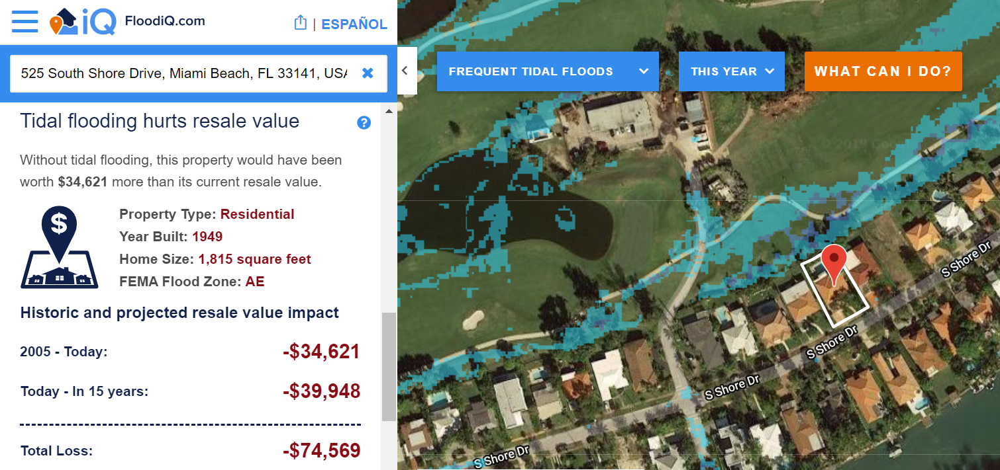

exclude: true

class: left, top
background-image: url(images/roadmap.png)
background-size: 100%
background-position: 50% 280%

```{r}
#place for different output choice
#  xaringan::moon_reader:
#    css: ["default", "default-fonts", "custom_Xaringan.css"]
#    lib_dir: libs
#    nature:
#      highlightStyle: github
#      highlightLines: true
#      countIncrementalSlides: false
```

```{r packages}
# Load packages.
packages <- c("tidyr", 
              "dplyr",
              "stringr",
              "purrr", 
              "data.table", 
              "maps",
              "glmnet",
              "tree",
              "knitr",
              "ggplot2",
              "gridExtra",
              "rgdal",
              "tmap",
              "leaflet"
              )
packages <- lapply(packages, FUN = function(x) {
  if(!require(x, character.only = TRUE)) {
    install.packages(x)
  library(x, character.only = TRUE)
  }
}
)
```

```{r setup}
library("knitr")
knitr::opts_chunk$set(
  echo = TRUE,
  eval = TRUE,
  message = FALSE,
  warning = FALSE,
  figure.height = 7,
  figure.width = 15,
  figure.align = "center",
  cache = TRUE,
  cache.lazy = FALSE
)
#knitr::opts_knit$set(root.dir = "C:\\Users\\Tianl\\Documents\\GitHub\\First-Street-Foundation")
options(htmltools.dir.version = FALSE)
```  

```{r theme-map}
theme_simplemap <- function(base_size = 9, base_family = "") {
  theme_bw(base_size = base_size, base_family = base_family) %+replace%
    theme(axis.line = element_blank(),
          axis.text = element_blank(),
          axis.ticks = element_blank(),
          axis.title = element_blank(),
          panel.background = element_blank(),
          panel.border = element_blank(),
          panel.grid = element_blank(),
          panel.spacing = unit(0, "lines"),
          plot.background = element_blank(),
          legend.position = "none")
}
``` 

##Simple AB Test
You own a vacation house in Florida. One day you are surprised to find its market value drops. Two explanations in seperate ways.

 - "Your home suffers from high risk from frequent tidal flooding."
 - "Your home would have worth $751,176, now it only worth $736,230 due to frequent tidal flooding."
 
Which one seems more convincing?

--

---
## Executive summary
Objective
 - Organizational mission: Quantify the financial risk of tidal flooding to address stakeholder concern
 - Task for this research: Make the numbers more accurate with market value estimation

Data
 - Administrative property records (3 million), transaction records from ATTOM Data Solutions
 - Demographic data from census data
 - Flooding projections and other climate data from National Oceanic and Atmospheric Administration (NOAA) 
 
Methodology
 - Build seperate models within each city and county to account for geographical variation and improve data quality
 - Regularization models (Ridge, LASSO) as baseline
 - Regression trees ry random forest and gradient boosting as comparison for trial models

Findings
 - Trees work better than baseline
 - Random forest algorithm consistently outperform gradient boosting
 - City-level models have varying performance
 - Ability to predict within 10% deviation in some cities
 - Key filtering parameters should be optimized to improve prediction
 - Transaction time and building area are 2 primary factors of property value
 
---
## Project roadmap

1. Data preparation
2. Exploratory analysis
3. Seperate modeling: one model for each city/county data
4. Feature selection with individual models
5. Build seperate predictive models for 85 city-level subsamples
6. Functionalities to test and parse out performance metrics for regularized models and regression trees
7. Personalize data filtering parameters
8. Iteration through cities/counties and view corss-validated model performance, map county-level model performance

---
## 1. Data preparation
Select features from property records in a real estate broker's database. 
```{r, eval=FALSE}
#Input original dataset 1: property data
home_dta_original<-fread("raw_data/SF_Home_Characteristics.csv")
save(home_dta_original, file = "dta_processed/SF_Taxassessor_original.RData")
#Select features to import, subset and save
home_dta <- select(
  home_dta_original,
  attomid,
  #Matching ID
  deedlastsaleprice,
  #Transaction price last sale
  situsstatecode,
  #State code
  situscounty,
  #County code
  propertyaddresscity,
  #City code
  ownertypedescription1,
  #First owner is individual/company?
  ownertypedescription2,
  #Second owner is individual/company?
  deedlastsaledate,
  #Date of market sale
  yearbuilt,
  #Year when built
  propertyusegroup,
  #Commercial/residential?
  areabuilding,
  #Living area in sq.feet
  censustract,
  #Census tract division
  propertylatitude,
  #Lat of property
  propertylongitude,
  #Lon of property
  roomsatticflag,
  #See below
  parkinggarage:communityrecroomflag#A series variable measuring physical attributes of the property, including rooms count and relevant facilities
)
save(home_dta, file = "dta_processed/SF_Taxassessor_reduced.RData")
```

---
## 1. Data preparation
Select features from environmental risk and demographic data set constructed by Porter
```{r, eval=FALSE}
#Import dataset 2: property and environmental risk, subset and save
risk_dta_original <-
  fread("raw_data/SF_Parcel_Risk_and_Spatial_Data.csv")
save(risk_dta_original, file = "dta_processed/SF_Parcel_Risk_and_Spatial_Data_original.RData")
risk_dta <- risk_dta_original %>% select(attomid = ATTOM_ID,#ID
                                         dist_coast,#Distance to coast
                                         mdkt32,#Flooding probability estimate in next years
                                         Totpopbg:near_reading_rates,)#a set of demographic information varying by census tract 
save(risk_dta, file = "dta_processed/SF_Parcel_Risk_and_Spatial_Data_reduced.RData")
```

---
## 1. Data preparation
Get a simple feature of transaction frequence from transaction records
```{r, eval=FALSE}
#Import dataset 3: property transactions, subset and save
trans_dta_original <-
  fread("raw_data/SF_Sales_Transactions_Data.csv")
save(trans_dta_original, file = "dta_processed/SF_Sales_Transactions_Data_original.RData")
trans_dta <-
  trans_dta_original %>% group_by(attomid) %>% summarize(trans_times = n())
save(trans_dta, file = "dta_processed/SF_Sales_Transactions_Data_reduced.RData")
```

```{r}
#Load and join saved RData
load("dta_processed/SF_Taxassessor_reduced.RData")
load("dta_processed/SF_Parcel_Risk_and_Spatial_Data_reduced.RData")
home_dta <- left_join(home_dta, risk_dta, by = "attomid")
load("dta_processed/SF_Sales_Transactions_Data_reduced.RData")
home_dta <- left_join(home_dta, trans_dta, by = "attomid")
```

```{r}
#Store (and report) a current version of data here
report.dim <- function(dta) {
  cat("Up to here, the data dimension is",
      dim(dta)[1],
      "*",
      dim(dta)[2])
}
home_dta_ver1 <- home_dta
home_dta_ver1 %>% report.dim()
```

---
## 1. Data preparation
Recoding and transforming features
```{r}
#This chunk of recoding is not supposed to change data dimension
#Fill in the price variable so that it will not be dropped later
home_dta$deedlastsaleprice[is.na(home_dta$deedlastsaleprice) == "TRUE"] <- 0
#Rounding deed last sale date to year and recoding NAs
home_dta$deedlastsaledate <-
  str_sub(home_dta$deedlastsaledate, start = 0, end = 4) %>%
  as.numeric()
home_dta$deedlastsaledate[home_dta$deedlastsaledate == ""] <- NA
#Make id numeric
home_dta$attomid <- home_dta$attomid %>% as.numeric()
#Recoding ownership type misseallenous to NA
home_dta$ownertypedescription1[home_dta$ownertypedescription1 %in% c ("NP", "UNKNOWN", "") |
                                 is.na(home_dta$ownertypedescription1) == TRUE] <- 0
home_dta$ownertypedescription2[home_dta$ownertypedescription2 %in% c ("NP", "UNKNOWN", "") |
                                 is.na(home_dta$ownertypedescription2) == TRUE] <- 0
```

---
## 1. Data preparation
Recoding and transforming features (cont'd)
```{r}
#Recoding property usage group
home_dta$propertyusegroup[home_dta$propertyusegroup%in% c ("NP", "UNKNOWN", "") |
                                 is.na(home_dta$propertyusegroup) == TRUE] <- 0
#152 PropertyUseStandardized is better coded, should do this in future
#class_coding<-read.csv("D:/raw_data/prop_use_codes_trim.csv")
#Excluding <50 sq. feet living area
home_dta$areabuilding[home_dta$areabuilding<50]<-NA
```

---
## 1. Data preparation
Drop all unary features
```{r}
#Drop unary variables in dataset
drop.unary <- function(dta) {
  for (i in names(dta)[-1:-which(names(home_dta)=="propertylongitude")]) {
    var <- dta[[i]]
    var <- var[is.na(var) == FALSE]
    if ((var %>% unique() %>% length() %in% c(0, 1))) {
      dta <- dta %>% select(-i)
    }
  }
  return(dta)
}
home_dta <- home_dta %>% drop.unary()
home_dta_ver1.5 <- home_dta
home_dta_ver1.5 %>% report.dim()
```

---
##1. Data preparation
Recoding and transforming features (cont'd)
```{r}
#Drop variables with too many levels, besides those are numerical
for (i in names(home_dta)[which(names(home_dta) == "parkinggarage"):which(names(home_dta) ==
                                                                          "mdkt32")]) {
  if ((home_dta[[i]] %>% unique() %>% length() > 10) &
      (str_detect(i, pattern = "area") == FALSE) &
      (str_detect(i, pattern = "count") == FALSE) &
      (!i %in% c("dist_coast", "mdkt32", "trans_times"))) {
    print(i)
    home_dta <- home_dta %>% select(-i)
  }
}
#Store a stage version of data here
home_dta_ver2 <- home_dta
home_dta_ver2 %>% report.dim()
```

---
##1. Data preparation
Recoding and transforming features (cont'd)
```{r}
#Give value 0 for NAs in less improtant variables so the obs will not be deleted
for (i in names(home_dta)[-1:-14]) {
  home_dta[[i]][is.na(home_dta[[i]]) == TRUE |
                  home_dta[[i]] == "" |
                  home_dta[[i]] == "NA"] <- 0
}
```

---
## 1. Data preparation
Recoding and transforming features (cont'd)
```{r}
#Recoded characters to factors.
cat("These variables are recoded to factors")
for (i in names(home_dta)) {
  if (class(home_dta[[i]]) == "character") {
    print(i)
    home_dta[[i]] <- home_dta[[i]] %>% as.factor()
  }
}
```

---

## 1. Data preparation
```{r}
#Get a list of large cities sufficient for consideration
city_obs <-
  group_by(home_dta, propertyaddresscity) %>% summarise(n())
names(city_obs) <- c("propertyaddresscity", "Properties")
```

---
## 1. Data preparation
Hold out cities with sample size too small to go into tree model.
```{r}
#For obtaining sufficient number of obs in each model, we drop cities with <5000 obs.
city_obs <- city_obs %>% filter(propertyaddresscity != "",
                                city_obs$Properties > 1000)
home_dta_less_city <-
  home_dta %>% filter(home_dta$propertyaddresscity %in% city_obs$propertyaddresscity)
home_dta <- home_dta_less_city
#Store a stage version of data here
home_dta_ver3 <- home_dta_less_city
home_dta_ver3 %>% report.dim()
```

---
## 2. Exploratory analysis
Plot summary graph of a few important variables to understand their overall statistical distribution
```{r}
#Plot summary of a few important variables
summary.variable <- function(varname = "deedlastsaleprice",
                             dta = home_dta) {
  #For numeric and integer variables
  if (class(dta[[varname]]) %in% c("numeric", "integer")) {
    m <- ggplot(data = dta) +
      geom_area(aes(x = dta[[varname]]),
                stat = "bin",
                fill = "khaki2") +
      xlab(paste(varname, class(dta[[varname]]))) +
      ylab("Properties") +
      theme_classic() +
      theme(axis.text.x = element_text(angle = 30, hjust = 1))
  }
  #For factors and logicals
  if (class(dta[[varname]]) %in% c("factor", "logical")) {
    m <- ggplot(data = dta) +
      geom_bar(aes(x = dta[[varname]]),
               fill = "khaki2") +
      xlab(paste(varname, class(dta[[varname]]))) +
      ylab("Properties") +
      theme_classic() +
      theme(axis.text.x = element_text(angle = 30, hjust = 1))
  }
  return(m)
}
```


```{r, eval=FALSE}
#Explorative function to plot summary statistics for a set of variables
var_plots <- lapply(colnames(home_dta), summary.variable)
grid_plot <- function(start_num = 1) {
  grid.arrange(
    var_plots[[start_num]],
    var_plots[[start_num + 1]],
    var_plots[[start_num + 2]],
    var_plots[[start_num + 3]],
    var_plots[[start_num + 4]],
    var_plots[[start_num + 5]],
    var_plots[[start_num + 6]],
    var_plots[[start_num + 7]],
    var_plots[[start_num + 8]],
    var_plots[[start_num + 9]],
    var_plots[[start_num + 10]],
    var_plots[[start_num + 11]],
    var_plots[[start_num + 12]],
    var_plots[[start_num + 13]],
    var_plots[[start_num + 14]],
    var_plots[[start_num + 15]],
    var_plots[[start_num + 16]],
    var_plots[[start_num + 17]],
    var_plots[[start_num + 18]],
    var_plots[[start_num + 19]]
  )
}
```

```{r, eval=FALSE}
grid_plot(1)
```

---
## 2. Exploratory analysis
Summarize a few key variables by county to see the geographical variation
```{r}
#Import shape file and save to rdata to reduce loading time
parcel <-
  readOGR(dsn = "raw_data/tl_2017_us_county", layer = "tl_2017_us_county")
counties <-
  c("Broward",
    "Collier",
    "Hendry",
    "Lee",
    "Miami-Dade",
    "Monroe",
    "Palm Beach")
parcel <-
  parcel[parcel@data$NAME %in% counties & parcel@data$STATEFP == "12", ]
#Summary a few key variables by county
county_summary <-
  home_dta %>% group_by(situscounty) %>% summarize(
    Number_of_Properties = n() %>% as.numeric(),
    Average_Price = mean(deedlastsaleprice %>%
                           as.numeric(), na.rm = TRUE),
    Average_Built_Year = mean(yearbuilt %>%
                                as.numeric(), na.rm = TRUE),
    Average_Living_Area = mean(areabuilding %>%
                                 as.numeric(), na.rm = TRUE)
  )
names(county_summary)[1] <- c("NAME")
parcel@data <- inner_join(parcel@data, county_summary, by = "NAME")
save(parcel, file = "graph_data/parcel.RData")
```

---
## 2. Exploratory analysis
```{r}
#Plot statistics by county
options(scipen = 10)
summary.county <- function(varname, par = parcel) {
  m <- tm_shape(parcel) +
    tm_fill(varname,
            palette = "GnBu") +
    tm_text("NAME", size = 0.6) +
    tm_borders(col = "black") +
    tm_layout(
      legend.title.size = 0.8,
      legend.text.size = 0.5,
      legend.position = c("left", "top"),
      legend.bg.color = "white",
      legend.bg.alpha = 0
    )
  return(m)
}
tmap_arrange(
  summary.county(varname = "Number_of_Properties"),
  summary.county(varname = "Average_Price"),
  summary.county(varname = "Average_Living_Area"),
  summary.county(varname = "Average_Built_Year"),
  nrow = 2
)
```

---
## 2. Exploratory analysis
```{r}
by_year_county <-
  home_dta %>% group_by(situscounty, deedlastsaledate) %>% summarize(
    num = n(),
    price =
      median(deedlastsaleprice, na.rm = TRUE),
    area = mean(areabuilding, na.rm =
                  TRUE),
    averageprice = mean(deedlastsaleprice /
                          areabuilding, na.rm = TRUE),
    builtyear = mean(yearbuilt, na.rm =
                       TRUE)
  )
#save(by_year_county,file = "graph_data/by_year_county.RData")
```

---
## 2. Exploratory analysis
```{r}
ggplot(by_year_county[by_year_county$deedlastsaledate > 1955 &
                        by_year_county$deedlastsaledate < 2019 &
                        is.na(by_year_county$deedlastsaledate) == FALSE &
                        is.na(by_year_county$county) == FALSE, ],
       aes(x = deedlastsaledate,
           y = price,
           color = situscounty)) +
  scale_color_brewer(palette = "Set3") +
  geom_line(data = by_year_county[by_year_county$deedlastsaledate > 1955 &
                                    by_year_county$deedlastsaledate < 2019, ]) +
  geom_point(data = by_year_county[by_year_county$deedlastsaledate > 1955 &
                                     by_year_county$deedlastsaledate < 2019, ]) +
  scale_x_continuous(name = "Year of transaction",
                     breaks = c(seq(1955, 2018, by = 5), 2018)) +
  scale_y_continuous(name = "Average transaction price ($)",
                     breaks = seq(0, 2000000, by = 200000)) +
  ggtitle("Historical transaction price in each county") +
  labs(caption = "Source: ATTOM Data Solutions") +
  theme_classic() +
  theme(axis.text.x = element_text(angle = 30, hjust = 1))
```

add transaction num by year

---
## 2. Exploratory analysis
```{r}
by_year_use <-
  home_dta[home_dta$propertyusegroup != 0, ] %>% group_by(propertyusegroup, deedlastsaledate) %>%
  summarize(
    num = n(),
    price =
      median(deedlastsaleprice, na.rm = TRUE),
    area = mean(areabuilding, na.rm =
                  TRUE),
    averageprice = mean(deedlastsaleprice /
                          areabuilding, na.rm = TRUE),
    builtyear = mean(yearbuilt, na.rm =
                       TRUE)
  )
#save(by_year_use,file = "D:/Langyi/graph_data/by_year_use.RData")
```

---
## 2. Exploratory analysis
```{r}
ggplot(by_year_use%>%filter(deedlastsaledate %in%c(1955:2019)),
       aes(x = deedlastsaledate,
           y = price,
           color = propertyusegroup)) +
  scale_color_brewer(palette = "Dark2") +
  geom_line() +
  geom_point() +
  scale_x_continuous(name = "Transaction year",
                     breaks = c(seq(1955, 2018, by = 5), 2018)) +
  scale_y_continuous(name = "Average property value ($)",
                     breaks = seq(0, 2000000, by = 200000)) +
  ggtitle("Historical price between commercial and residential properties") +
  labs(caption = "Source: ATTOM Data Solutions") +
  theme_classic() +
  theme(axis.text.x = element_text(angle = 30, hjust = 1))
```


---
## 2. Exploratory analysis
```{r}
by_year_own <-
  home_dta %>% filter(ownertypedescription1 != 0) %>% group_by(ownertypedescription1, deedlastsaledate) %>%
  summarize(
    num = n(),
    price =
      median(deedlastsaleprice, na.rm = TRUE),
    area = mean(areabuilding, na.rm =
                  TRUE),
    averageprice = mean(deedlastsaleprice /
                          areabuilding, na.rm = TRUE),
    builtyear = mean(yearbuilt, na.rm =
                       TRUE)
  )
#save(by_year_own,file = "D:/Langyi/graph_data/by_year_own.RData")
```

---
## 2. Exploratory analysis
```{r}
ggplot(by_year_own%>%filter(deedlastsaledate %in%c(1955:2019)),
       aes(x = deedlastsaledate,
           y = price,
           color = ownertypedescription1)) +
  scale_color_brewer(palette = "Accent")+
  geom_line()+
  geom_point()+
  scale_x_continuous(name="Transaction year", 
                     breaks=c(seq(1955,2018,by=5),2018))+
  scale_y_continuous(name="Average property value ($)", 
                     breaks=seq(0,2000000,by=200000))+
  ggtitle("Historical price between company-ownerd and individual-owned properties")+
  labs(caption = "Source: ATTOM Data Solutions")+
  theme_classic()+
  theme(axis.text.x=element_text(angle=30, hjust=1))
```

```{r}
home_dta_flood <- home_dta
med_dist_coast <- median(home_dta_flood$dist_coast, na.rm = TRUE)
med_floodrisk <- median(home_dta_flood$mdkt32, na.rm = TRUE)
home_dta_flood$dist_coast1 <- NA
home_dta_flood$dist_coast1[home_dta_flood$dist_coast <= med_dist_coast] <-
  "no flood risk"
home_dta_flood$dist_coast1[home_dta_flood$dist_coast > med_dist_coast] <-
  "with flood risk"
home_dta_flood$dist_coast1 <-
  home_dta_flood$dist_coast1 %>% as.character()
home_dta_flood$floodrisk1 <- NA
home_dta_flood$floodrisk1[home_dta_flood$mdkt32 <= med_floodrisk] <-
  "no flood risk"
home_dta_flood$floodrisk1[home_dta_flood$mdkt32 > med_floodrisk] <-
  "with flood risk"
home_dta_flood$floodrisk1 <-
  home_dta_flood$floodrisk1 %>% as.character()
by_year_floodrisk <-
  home_dta_flood %>% group_by(floodrisk1, deedlastsaledate) %>% summarize(
    num = n(),
    price = median(deedlastsaleprice, na.rm = TRUE),
    area = mean(areabuilding, na.rm = TRUE),
    averageprice = mean(deedlastsaleprice / areabuilding, na.rm = TRUE),
    averagefrequency = mean(trans_times, na.rm = TRUE),
    builtyear = mean(yearbuilt, na.rm = TRUE)
  )
#save(by_year_floodrisk,file = "D:/Langyi/graph_data/by_year_floodrisk.RData")
```

---
## 2. Exploratory analysis
```{r}
ggplot(
  by_year_floodrisk %>% filter(deedlastsaledate %in% c(1955:2019)),
  aes(x = deedlastsaledate,
      y = price,
      color = floodrisk1)
) +
  scale_color_brewer(palette = "Set2") +
  geom_line() +
  geom_point() +
  scale_x_continuous(name = "Year of transaction",
                     breaks = c(seq(2000, 2018, by = 5), 2018)) +
  scale_y_continuous(name = "Average transaction price ($)",
                     breaks = seq(0, 2000000, by = 200000)) +
  ggtitle("Average transaction price for risky assets and non-risky assets") +
  labs(caption = "Source: ATTOM Data Solutions") +
  theme_classic() +
  theme(axis.text.x = element_text(angle = 30, hjust = 1))
```


```{r}
ggplot(by_year_floodrisk %>% filter(deedlastsaledate %in% c(2000:2019)),
       aes(x = deedlastsaledate,
           y = averagefrequency,
           color = floodrisk1)) +
  scale_color_brewer(palette = "Set2") +
  geom_line() +
  geom_point() +
  scale_x_continuous(name = "Year of transaction",
                     breaks = c(seq(2000, 2018, by = 5), 2018)) +
  scale_y_continuous(name = "Average transaction price ($)",
                     breaks = seq(0, 2000000, by = 200000)) +
  ggtitle("Average transaction frequency for risky assets and non-risky assets") +
  labs(caption = "Source: ATTOM Data Solutions") +
  theme_classic() +
  theme(axis.text.x = element_text(angle = 30, hjust = 1))
```

---
## 2. Exploratory analysis
```{r}
by_city <-
  home_dta_flood %>% group_by(propertyaddresscity) %>% summarize(
    num = n(),
    county = unique(situscounty)[1],
    price =
      median(deedlastsaleprice, na.rm = TRUE),
    area = median(areabuilding, na.rm =
                    TRUE),
    averageprice = median(deedlastsaleprice /
                            areabuilding, na.rm = TRUE),
    averagefrequency = mean(trans_times, na.rm =
                              TRUE),
    builtyear = median(yearbuilt, na.rm =
                         TRUE),
    floodrisk = mean(mdkt32, na.rm = TRUE)
  )
med_floodrisk <- median(by_city$floodrisk, na.rm = TRUE)
by_city$floodrisk1 <- NA
by_city$floodrisk1[by_city$floodrisk == 0] <- "no flood risk"
by_city$floodrisk1[by_city$floodrisk <= med_floodrisk &
                     by_city$floodrisk > 0] <- "low flood risk"
by_city$floodrisk1[by_city$floodrisk > med_floodrisk] <-
  "high flood risk"
by_city$floodrisk1 <- by_city$floodrisk1 %>% as.character()
#save(by_city,file = "D:/Langyi/graph_data/by_city.RData")
```

```{r, eval=FALSE}
by_city_year<-home_dta_flood%>%group_by(propertyaddresscity,deedlastsaledate)%>%summarize(num=n(),
                                                              county=unique(situscounty)[1],
                                                                                           price=median(deedlastsaleprice,na.rm=TRUE),
                                                  area=median(areabuilding,na.rm=TRUE),
                                              averageprice=median(deedlastsaleprice/areabuilding,na.rm=TRUE),
                                              averagefrequency=mean(trans_times,na.rm=TRUE),
                                              builtyear=median(yearbuilt,na.rm=TRUE),
                                              floodrisk=mean(mdkt32,na.rm = TRUE)
                                                  )
med_floodrisk<-median(by_city_year$floodrisk,na.rm = TRUE)
by_city_year$floodrisk1<-NA
by_city_year$floodrisk1[by_city_year$floodrisk==0]<-"no flood risk"
by_city_year$floodrisk1[by_city_year$floodrisk<=med_floodrisk&
                     by_city_year$floodrisk>0]<-"low flood risk"
by_city_year$floodrisk1[by_city_year$floodrisk>med_floodrisk]<-"high flood risk"
by_city_year$floodrisk1<-by_city_year$floodrisk1%>%as.character()
#save(by_city_year,file = "D:/Langyi/graph_data/by_city_year.RData")
```

---
## 2. Exploratory analysis
```{r}
ggplot(by_city,
       aes(x = averagefrequency,
           y = price,
           size = num,
           color= floodrisk1)) +
  geom_point()+
  scale_color_brewer(palette = "OrRd", 
                     direction=-1)+
  scale_size(guide = "none")+
  scale_x_continuous(name="Average transaction times in market")+
  scale_y_continuous(name="Average property value ($)", 
                     breaks=seq(0,2000000,by=200000))+
  geom_text(data=by_city[by_city$num>15000,],
            aes(label=propertyaddresscity),
            position=position_jitter(width=1,height=1),
            color="black",
            size=2.5, hjust=-0.3, vjust=-0.3)+
  ggtitle("Average property price and transaction frequency in cities with different flooding risk",
          subtitle = "Large cities annotated")+
  labs(caption = "Source: ATTOM Data Solutions")+
  theme_classic()
```

---
## 2. Exploratory analysis
```{r}
ggplot(by_city,
       aes(x = builtyear,
           y = price,
           size = num,
           color = floodrisk1)) +
  geom_point()+
  scale_size(guide = "none")+
  scale_color_brewer(palette = "OrRd", 
                     direction=-1)+
  scale_x_continuous(name="Year built of property", 
                     breaks=c(seq(1950,2018,by=5),2018))+
  scale_y_continuous(name="Average property value ($)", 
                     breaks=seq(0,2000000,by=200000))+
  geom_text(data=by_city[by_city$num>15000,],
            aes(label=propertyaddresscity),
            position=position_jitter(width=1,height=1),
            color= "black",size=2.5, hjust=-0.3, vjust=-0.3)+
  ggtitle("Average property price and year built in in cities with different flooding risk",
          subtitle = "Large cities annotated")+
  labs(caption = "Source: ATTOM Data Solutions")+
  theme_classic()+
  theme(axis.text.x=element_text(angle=30, hjust=1))
```


---
## 3. Seperate modeling: one model for each city/county data
This means for every city/county in South Florida, we fit an individual model to it seperately.

Inspired by the "submarket" idea
 - The housing prices between neibourhoods, cities and counties vary a lot
 
Feature structure vary by county
 - There are some variables that represent housing attributes that miss in data with different cases between counties.
 
---
## 3. Seperate modeling: one model for each city/county data
The process for county-level modeling is rather straightforward.
```{r}
home_dta_less_city$propertyaddresscity <-
  home_dta_less_city$propertyaddresscity %>% as.character()
#Split data at city level
home_city_dta <-
  split(home_dta_less_city, home_dta_less_city$propertyaddresscity)
#Split data at county level, get rid of census tract
home_county_dta <-
  split(select(home_dta, -censustract), home_dta$situscounty)
```

---
## 4. Feature selection with individual models
Build function to automatically drop variables that are not important and are missing over 10% values, as we don't wish too many obs are omitted in tree model due to missing value.
```{r}
#Function to determine whether a variable is missing less than 10% values
is.missing <- function(var, ratio = 0.1) {
  a <- var %>% length()
  b <- var %>% is.na() %>% sum()
  b / a < ratio
}
#Function to preprocess a data frame and drop according to is.missing
#Here some features are kept due to their apparent relevancy which does not worth being dropped due to missing values
drop.missing <- function(dta) {
  varnames_important <- names(dta)[1:14]
  varnames_supplement <- names(dta)[-1:-14]
  for (i in varnames_important) {
    var <- dta[[i]]
    if (is.missing(var, ratio = 0.5) == "FALSE") {
      dta <- select(dta, -i)
    }
  }
  for (i in varnames_supplement) {
    var <- dta[[i]]
    if (is.missing(var, ratio = 0.1) == "FALSE") {
      dta <- select(dta, -i)
    }
  }
  return(dta)
}
```

---
## 4. Feature selection with individual models
Apply the selection functions built just now to all subsamples
```{r}
#Apply to city the function in previous function for feature selection
home_city_cleaned_dta <- purrr::map(home_city_dta, drop.missing)
home_city_cleaned_dta <- purrr::map(home_city_cleaned_dta, drop.unary)
#Apply to county the function in previous function for feature selection
home_county_cleaned_dta <- purrr::map(home_county_dta, drop.missing)
home_county_cleaned_dta <- purrr::map(home_county_cleaned_dta, drop.unary)
```
---
## 5. Interactivity to check individual properties within sample (a playaround...)
Build the ability to check for key features of individual properties using Google map
```{r}
#Provide an interactive leaflet for checking individual properties, Hendry County as an example.
map.variable<-function(dta=home_county_cleaned_dta$Hendry,
                       varname="propertyusegroup"){
if (varname%in%names(dta)==TRUE&
    "propertylatitude"%in%names(dta)==TRUE&
    "propertylongitude"%in%names(dta)==TRUE){
  dta<-dta[is.na(dta[[varname]])==FALSE,]
library(leaflet)
pal = colorFactor("Set1", dta[[varname]])
color_offsel1 = pal(dta[[varname]])
leaflet(dta) %>%
  addTiles() %>%
  addCircleMarkers(lng = ~propertylongitude, 
             lat = ~propertylatitude,
             color = color_offsel1,
             popup = content<<-str_c(varname,
                                     dta[[varname]],
                                     "Market price",
                                     dta$deedlastsaleprice,
                                     "Transaction date",
                                     dta$deedlastsaledate,
                                     "Living area",
                                     dta$areabuilding,
                                     sep = " "),
             clusterOptions = markerClusterOptions())%>%
  addLegend(pal = pal, values = ~dta[[varname]], title = varname)
} else {print("Variables filtered out in final data, unable to plot map for this subsample")
}
}
```
---
## 5. Interactivity to check individual properties within sample (a playaround...)
Build the ability to check for key features of individual properties using Google map
```{r, eval=FALSE,echo=TRUE, warning=FALSE}
map.variable(dta = home_city_cleaned_dta$AVENTURA)
```

---
## 6. Build predictive models for individual subgroups
Develop functionality for final preprocessing before feeding data into model. Here we want to deal within each model very precisely the control of missing values and division of training/test test. Therefore, the process was distributed to each subsample and run independently.
```{r}
#Build final preprocess function
model.preprocess <- function(dta,
                             price_high,
                             price_low,
                             start_year,
                             size) {
  #Delete lng/lat info used for geomapping
  dta$propertylatitude<-NULL
  dta$propertylongitude<-NULL
  #Recode tract to factor. If there are more than 32 tracts, exclude tracts.
  if ("censustract" %in% names(dta)) {
    if (dta$censustract %>% unique() %>% length() < 32) {
      dta$censustract <- dta$censustract %>% as.factor()
    } else {
      dta <- dta %>% select(-censustract)
    }
  }
  dta <-
    filter(dta, is.na(dta$deedlastsaleprice) == FALSE)#Exclude NA in y variable
  row_before <- nrow(dta)
  #Excluding high value transactions to suppress extreme values for convenience
  dta$deedlastsaleprice[dta$deedlastsaleprice >= price_high] <- NA
  #Excluding low value transactions which are not authentic
  dta$deedlastsaleprice[dta$deedlastsaleprice <= price_low] <- NA
  dta$deedlastsaleprice <- dta$deedlastsaleprice %>% as.numeric()
  #Exclude NA in y variable again
  dta <- filter(dta, is.na(dta$deedlastsaleprice) == FALSE)
  row_after <- nrow(dta)
  retention <<- row_after / row_before
  #Pick a start year for modeling
  if ("deedlastsaledate" %in% names(dta))
    dta <- dta %>% filter(deedlastsaledate >= start_year)
  #Option to reduce sample size for computation convenience
  set.seed(0)
  if (nrow(dta) >= size) {
    dta <- sample_n(dta, size)
  }
  dta <- drop.unary(dta)
  return(dta)
}
```

---
## 6. Build predictive models for individual subgroups
I decided to use random forest and gradient boosting as the first try. Random forest deal with data with large variations well while boosting is good at learn specific models, so they are a good compensation to each other. In addition, tree algorithms always return variable importance, which is useful for subsequent model selection.

Here a model comparison with output from random forest and gradient boosting is built. It will generate several attributes of the model as well as some key performance index of the 2 tree algorithms.

```{r}
model.comparison.tree <-
  function(dta, preprocess_retention = retention) {
    #Split training/test samples (0.7:0.3)
    train <- sample_frac(dta, size = 0.7)
    test <- anti_join(dta, train, by = "attomid")
    #Prepare y and x features
    train <-
      select(train,
             -attomid,
             -situsstatecode,
             -situscounty,
             -propertyaddresscity)
    y <- train$deedlastsaleprice
    x <- select(train, -deedlastsaleprice)
    #Try random forest
    library(randomForest)
    train_rf <- randomForest(y ~ ., x,
                             importance = TRUE,
                             na.action = "na.omit")
    rf_summary <- importance(train_rf) %>% as.data.frame()
    rf_highvars <- rf_summary[order(rf_summary$`%IncMSE`,
                                    decreasing = TRUE),] %>% head(5) %>% row.names()
    if (length(rf_highvars) < 5) {
      rf_highvars <- c(rf_highvars, rep(NA, (5 - length(rf_highvars))))
    }
    #Test set
    yhat.rf <- predict(train_rf, test)
    rf_MSE <-
      mean((yhat.rf - test$deedlastsaleprice) ^ 2, na.rm = TRUE)
    rf_MPE <-
      mean((yhat.rf - test$deedlastsaleprice) / test$deedlastsaleprice,
           na.rm = TRUE)
    rf_MAPE <-
      mean(abs((yhat.rf - test$deedlastsaleprice) / test$deedlastsaleprice), na.rm = TRUE)
    #Boosting
    library(gbm)
    train_gb <- gbm(y ~ ., x,
                    n.trees = 1000,
                    distribution = "gaussian")
    gb_summary <- summary(train_gb, plotit = FALSE)
    gb_highvars <- gb_summary[order(gb_summary$rel.inf,
                                    decreasing = TRUE),] %>% head(5) %>% row.names()
    if (length(gb_highvars) < 5) {
      add <- 5 - length(gb_highvars)
      gb_highvars <- c(gb_highvars, rep(NA, add))
    }
    #Test set
    yhat.gb <- predict(train_gb, test, n.trees = 1000)
    gb_MSE <-
      mean((yhat.gb - test$deedlastsaleprice) ^ 2, na.rm = TRUE)
    gb_MPE <-
      mean((yhat.gb - test$deedlastsaleprice) / test$deedlastsaleprice,
           na.rm = TRUE)
    gb_MAPE <-
      mean(abs((yhat.gb - test$deedlastsaleprice) / test$deedlastsaleprice), na.rm = TRUE)
    #Store comparison between rf and gb
    if (dta$propertyaddresscity %>% unique() %>% length() == 1) {
      subsample_name <-
        paste(
          dta$situsstatecode %>% unique() %>% as.character() %>% paste(collapse =
                                                                         "_"),
          dta$situscounty %>% unique() %>% as.character() %>%
            paste(collapse = "_"),
          dta$propertyaddresscity %>% unique() %>% as.character() %>%
            paste(collapse = "_"),
          sep = "_"
        )
    } else {
      subsample_name <-
        paste(
          dta$situsstatecode %>% unique() %>% as.character() %>% paste(collapse =
                                                                         "_"),
          dta$situscounty %>% unique() %>% as.character() %>%
            paste(collapse = "_")
        )
      
    }
    comparison <- c(
      subsample_name,
      preprocess_retention,
      nrow(dta),
      ncol(dta),
      rf_MSE,
      rf_MPE,
      rf_MAPE,
      rf_highvars,
      gb_MSE,
      gb_MPE,
      gb_MAPE,
      gb_highvars
    ) %>% as.data.frame %>% t()
    colnames(comparison) <- c(
      "subsample",
      "preprocess_retention",
      "obs",
      "vars",
      "rf_MSE",
      "rf_MPE",
      "rf_MAPE",
      "rf_1st",
      "rf_2nd",
      "rf_3rd",
      "rf_4th",
      "rf_5th",
      "gb_MSE",
      "gb_MPE",
      "gb_MAPE",
      "gb_1st",
      "gb_2nd",
      "gb_3rd",
      "gb_4th",
      "gb_5th"
    )
    return(comparison)
  }
```

```{r}
model.comparison.regularization <-
  function(dta, preprocess_retention = retention) {
    preprocess_retention <- retention
    #Split training/test samples (0.7:0.3)
    train <- sample_frac(dta, size = 0.7)
    test <- anti_join(dta, train, by = "attomid")
    #Prepare y and x features in train
    train <- train %>% select(-attomid,-situsstatecode,-situscounty,-propertyaddresscity)
    essential.var <- intersect(names(dta),
                               c(
                                 "deedlastsaledate",
                                 "yearbuilt",
                                 "areabuilding",
                                 "censustract"
                               )) %>% paste(collapse = "+")
    if ("deedlastsaledate" %in% names(dta)) {
      formula.1 <- as.formula(
        paste(
          "deedlastsaleprice~
                   I(deedlastsaledate^5)+
                  I(deedlastsaledate^4)+
                  I(deedlastsaledate^3)+
                  I(deedlastsaledate^2)+(",
          paste(essential.var),
          ")^2+
                    (.)"
        )
      )
    } else{
      formula.1 <-
        as.formula(paste("deedlastsaleprice~(", paste(essential.var), ")^2+(.)"))
    }
    train <- model.frame(formula.1,
                         data = train,
                         na.action = na.omit)
    y.train <- train$deedlastsaleprice
    x.train <- model.matrix(formula.1,
                            data = train)
    #Prepare test
    test <- test %>% select(-attomid,-situsstatecode,-situscounty,-propertyaddresscity)
    test <- model.frame(formula.1,
                        data = test,
                        na.action = na.omit)
    y.test <- test$deedlastsaleprice
    x.test <- model.matrix(formula.1,
                           data = test)
    #Predict with Ridge
    cv.out <- cv.glmnet(x.train, y.train, alpha = 0)
    bestlam <- cv.out$lambda.min
    out <-
      glmnet(
        x.train,
        y.train,
        nlambda = 1,
        lambda = bestlam,
        alpha = 0
      )
    yhat.ridge <- predict(cv.out, s = bestlam, newx <- x.test)
    ridge_MSE <- mean((yhat.ridge - y.test) ^ 2, na.rm = TRUE)
    ridge_MPE <- mean((yhat.ridge - y.test) / y.test, na.rm = TRUE)
    ridge_MAPE <- mean(abs((yhat.ridge - y.test) / y.test), na.rm = TRUE)
    #Predict with LASSO
    cv.out <- cv.glmnet(x.train, y.train, alpha = 1)
    bestlam <- cv.out$lambda.min
    out <-
      glmnet(
        x.train,
        y.train,
        nlambda = 1,
        lambda = bestlam,
        alpha = 1
      )
    yhat.LASSO <- predict(cv.out, s = bestlam, newx <- x.test)
    LASSO_MSE <- mean((yhat.LASSO - y.test) ^ 2, na.rm = TRUE)
    LASSO_MPE <- mean((yhat.LASSO - y.test) / y.test, na.rm = TRUE)
    LASSO_MAPE <- mean(abs((yhat.LASSO - y.test) / y.test), na.rm = TRUE)
    #Export important variables
    LASSO_coef <-
      coef(out) %>% row.names() %>% cbind(coef(out) %>% as.numeric())
    LASSO_coef <- LASSO_coef %>% as.data.frame()
    names(LASSO_coef) <- c("var", "coef")
    LASSO_coef$coef <- LASSO_coef$coef %>% as.character() %>% as.numeric()
    LASSO_coef$var <- LASSO_coef$var %>% as.character()
    LASSO_coef$abs_coef <- abs(LASSO_coef$coef)
    LASSO_coef <-
      LASSO_coef[order(LASSO_coef$abs_coef, decreasing = TRUE), ]
    LASSO_vars <- LASSO_coef$var[LASSO_coef$coef != 0 &
                                   LASSO_coef$var != "(Intercept)"]
    LASSO_length <- LASSO_vars %>% length()
    LASSO_names <- LASSO_vars %>% paste(collapse = "  |  ")
    #Store comparison between Ridge and LASSO
    if (dta$propertyaddresscity %>% unique() %>% length() == 1) {
      subsample_name <-
        paste(
          dta$situsstatecode %>% unique() %>% as.character() %>% paste(collapse =
                                                                         "_"),
          dta$situscounty %>% unique() %>% as.character() %>%
            paste(collapse = "_"),
          dta$propertyaddresscity %>% unique() %>% as.character() %>%
            paste(collapse = "_"),
          sep = "_"
        )
    } else {
      subsample_name <-
        paste(
          dta$situsstatecode %>% unique() %>% as.character() %>% paste(collapse =
                                                                         "_"),
          dta$situscounty %>% unique() %>% as.character() %>%
            paste(collapse = "_")
        )
      
    }
    comparison <- c(
      subsample_name,
      preprocess_retention,
      nrow(dta),
      ncol(dta),
      ridge_MSE,
      ridge_MPE,
      ridge_MAPE,
      LASSO_MSE,
      LASSO_MPE,
      LASSO_MAPE,
      LASSO_length,
      LASSO_names
    ) %>% as.data.frame %>% t()
    colnames(comparison) <- c(
      "subsample",
      "preprocess_retention",
      "obs",
      "vars",
      "ridge_MSE",
      "ridge_MPE",
      "ridge_MAPE",
      "LASSO_MSE",
      "LASSO_MPE",
      "LASSO_MAPE",
      "LASSO_length",
      "LASSO_names"
    )
    return(comparison)
  }
```

---
## 6. Build predictive models for individual subgroups
Assembling the final modeling function combining the previous 2 functions and applicable to large list.
```{r}
#Build function to parse modeling output and realize parameter entry
modeling <- function(list,
                     method = "regularization",
                     price_h = 5000000,
                     price_l = 100,
                     yr_st = 2012,
                     sz = 1000) {
  comparison_set <- NULL
  for (i in 1:length(list)) {
    dta <- list[[i]]
    dta_preprocessed <- model.preprocess(
      dta,
      price_high = price_h,
      price_low = price_l,
      start_year = yr_st,
      size = sz
    )
    if (method == "tree") {
      comparison <- model.comparison.tree(dta_preprocessed)
    }
    if (method == "regularization") {
      comparison <- model.comparison.regularization(dta_preprocessed)
    }
    comparison_set <- rbind(comparison_set, comparison)
  }
  comparison_set <- cbind(
    rep(price_h, nrow(comparison_set)),
    rep(price_l, nrow(comparison_set)),
    rep(yr_st, nrow(comparison_set)),
    rep(sz, nrow(comparison_set)),
    comparison_set
  )
  comparison_set <- comparison_set %>% as.data.frame()
  names(comparison_set)[1:4] <-
    c("price_high", "price_low", "year_start", "size")
  comparison_set$preprocess_retention <-
    comparison_set$preprocess_retention %>% as.character() %>% as.numeric()
  num_vars <- c(
    "obs",
    "vars",
    "rf_MSE",
    "rf_MAPE",
    "gb_MSE",
    "gb_MPE",
    "gb_MAPE",
    "ridge_MSE",
    "ridge_MPE",
    "ridge_MAPE",
    "LASSO_MSE",
    "LASSO_MPE",
    "LASSO_MAPE",
    "LASSO_length"
  )
  for (i in names(comparison_set)) {
    if (i %in% num_vars) {
      comparison_set[[i]] <-
        comparison_set[[i]] %>% as.character() %>% as.numeric()
    }
  }
  return(comparison_set)
}
```

---
## 7. Test between 4 algorithms
Test in subsample of cities and counties, compare several KPI of models to see which of random forest and gradient boosting does the job better.
```{r, eval=FALSE}
model_city_tree <- modeling(home_city_cleaned_dta, "tree", sz = 300)
model_city_regularization <-
  modeling(home_city_cleaned_dta, "regularization", sz = 10000)
model_summary <- inner_join(
  model_city_tree,
  model_city_regularization %>% select(subsample,
                                       ridge_MSE:LASSO_names)
)
save(model_summary, file = "dta_processed/model_summary.RData")
```

---
## 7.5 Visualize model performance
```{r}
load("dta_processed/model_summary.RData")
city_stats <-
  home_dta %>% group_by(propertyaddresscity) %>% summarise(
    num = n(),
    subsample =
      str_c(situsstatecode[1],
            situscounty[1],
            propertyaddresscity[1],
            sep = "_"),
    price = median(deedlastsaleprice, na.rm = TRUE),
    area = median(areabuilding, na.rm = TRUE),
    averageprice = median(deedlastsaleprice / areabuilding, na.rm = TRUE),
    builtyear = median(yearbuilt, na.rm = TRUE),
    dist_coast = mean(dist_coast, na.rm = TRUE),
    floodrisk = mean(mdkt32, na.rm = TRUE)
  )
major_models <- city_stats %>% inner_join(model_summary, by = "subsample")
major_models$rf_MPE <-
  major_models$rf_MPE %>% as.character() %>% as.numeric()
med_floodrisk1 <- median(major_models$floodrisk, na.rm = TRUE)
major_models$floodrisk1 <- NA
major_models$floodrisk1[major_models$floodrisk == 0] <- "no flood risk"
major_models$floodrisk1[major_models$floodrisk > 0 &
                          major_models$floodrisk <= med_floodrisk1] <-
  "low flood risk"
major_models$floodrisk1[major_models$floodrisk > med_floodrisk1] <-
  "high flood risk"
#save(major_models,file = "D:/Langyi/graph_data/major_models.RData")
```

```{r}
data.table::data.table(major_models)
```

---
## 7.5 Visualize model performance
```{r}
ggplot(major_models,
       aes(
         x = price,
         y = floodrisk,
         color = floodrisk1,
         size = num,
         shape = rf_1st
       )) +
  geom_point() +
  geom_jitter() +
  scale_size(guide = "none")+
  scale_color_brewer(palette = "OrRd",
                     direction = -1) +
  scale_x_continuous(name = "Average property value ($)",
                     breaks = seq(0, 2000000, by = 200000)) +
  scale_y_continuous(name = "Level of flood risk") +
  geom_text(
    data = major_models%>%filter(rf_MPE < 0.3,
                                 floodrisk > 0.03),
    aes(label = propertyaddresscity),
    color = "black",
    size = 2.5,
    hjust = -0.3,
    vjust = -0.3
  ) +
  ggtitle("Primary factor of property value in cities",
          subtitle = "Cities with high flood risk and high prediction accuracy (within 30%) annotated") +
  labs(caption = "Source: ATTOM Data Solutions") +
  theme_classic() +
  theme(axis.text.x = element_text(angle = 30, hjust = 1))
```


---
## 8. Personalize filtering parameters for random forest
Build plotting function. We want to see if we can control what data we put in, how to do so can help us get best results.
```{r}
#Build function to plot series of error for a given tuning parameter
error.plot <- function(dta = error_matrix) {
  retention <- ggplot(data = dta) +
    geom_line(aes(x = Parameter,
                  y = Retention),
              color = "tomato1") +
    xlab("Parameter values") +
    theme(legend.position = "left") +
    theme_classic()
  mse <- ggplot(data = dta) +
    geom_line(aes(x = Parameter,
                  y = MSE),
              color = "tomato2") +
    xlab("Parameter values") +
    theme(legend.position = "left") +
    theme_classic()
  mpe <- ggplot(data = dta) +
    geom_line(aes(x = Parameter,
                  y = MPE),
              color = "tomato3") +
    xlab("Parameter values") +
    theme(legend.position = "left") +
    theme_classic()
  mape <- ggplot(data = dta) +
    geom_line(aes(x = Parameter,
                  y = MAPE),
              color = "tomato4") +
    xlab("Parameter values") +
    theme(legend.position = "left") +
    theme_classic()
  grid.arrange(retention, mse, mape, mpe)
}
```
---
## 8. Personalize filtering parameters for random forest
Error performance for maximum observation within each model. 
```{r, eval=FALSE}
error_matrix<-NULL
for (i in seq(100,1000,by=100)){
output<-modeling(home_county_cleaned_dta,
                 method="tree",
                      price_h=5000000,
                      price_l=100,
                      sz=i,
                      yr_st=2012)
error_performance<-cbind(i,
                         output$preprocess_retention%>%mean(),
                         output$rf_MSE%>%mean(),
                         output$rf_MPE%>%mean(),
                         output$rf_MAPE%>%mean()
)
error_matrix<-rbind(error_matrix,error_performance)
}
colnames(error_matrix)<-c("Parameter","Retention","MSE","MPE","MAPE")
error_matrix<-error_matrix%>%as.data.frame()
save(error_matrix,file = "dta_processed/sz.RData")
```
---
## 8. Personalize filtering parameters for random forest
This one looks at maximum size of sample in each model. Overall, a larger sample size does help to improve prediction. If not because of computation power constraint, a larger sample should've been used.
```{r}
load("dta_processed/sz.RData")
error.plot(error_matrix)
```

---
## 8. Personalize filtering parameters for random forest
Error performance for lowest price acceptable for property

```{r, eval=FALSE}
error_matrix<-NULL
for (i in c(100,200,300,500,700,1000,3000,5000,7000,10000)){
output<-modeling(home_county_cleaned_dta,
                 method="tree",
                      price_h=5000000,
                      price_l=i,
                      sz=500, 
                      yr_st=2012)
error_performance<-cbind(i,
                         output$preprocess_retention%>%mean(),
                         output$rf_MSE%>%mean(),
                         output$rf_MPE%>%mean(),
                         output$rf_MAPE%>%mean()
)
error_matrix<-rbind(error_matrix,error_performance)
}
colnames(error_matrix)<-c("Parameter","Retention","MSE","MPE","MAPE")
error_matrix<-error_matrix%>%as.data.frame()
save(error_matrix,file = "dta_processed/price_l.RData")
```
---
## 8. Personalize filtering parameters for random forest
This one looks at lowest price acceptable for property. We can see there's a tradeoff between having better prediction and having less data.
```{r}
load("dta_processed/price_l.RData")
error.plot(error_matrix)
```

---
## 8. Personalize filtering parameters for random forest
Error performance for starting year to filter the properties
```{r, eval=FALSE}
error_matrix<-NULL
for (i in c(2000,2004,2007,2010,2012,2014,2015,2016,2017)){
output<-modeling(home_county_cleaned_dta,
                 method="tree",
                      price_h=5000000,
                      price_l=100,
                      sz=500, 
                      yr_st=i)
error_performance<-cbind(i,
                         output$preprocess_retention%>%mean(),
                         output$rf_MSE%>%mean(),
                         output$rf_MPE%>%mean(),
                         output$rf_MAPE%>%mean()
)
error_matrix<-rbind(error_matrix,error_performance)
}
colnames(error_matrix)<-c("Parameter","Retention","MSE","MPE","MAPE")
error_matrix<-error_matrix%>%as.data.frame()
save(error_matrix,file = "dta_processed/yr_st.RData")
```
---
## 8. Personalize filtering parameters for random forest
This one looks at starting year to filter the properties. It seems constraining to certain recent year may help, but we want to further figure out what's its impact on the sample size.
```{r}
load("dta_processed/yr_st.RData")
error.plot(error_matrix)
```

---
## 8. Personalize filtering parameters for random forest
Error performance for highest price acceptable for properties. 
```{r, eval=FALSE}
error_matrix<-NULL
for (i in c(100000,300000,500000,700000,1000000,3000000,5000000,7000000,10000000)){
output<-modeling(home_county_cleaned_dta,
                 method="tree",
                      price_h=i,
                      price_l=100,
                      sz=500, 
                      yr_st=2012)
error_performance<-cbind(i,
                         output$preprocess_retention%>%mean(),
                         output$rf_MSE%>%mean(),
                         output$rf_MPE%>%mean(),
                         output$rf_MAPE%>%mean()
)
error_matrix<-rbind(error_matrix,error_performance)
}
colnames(error_matrix)<-c("Parameter","Retention","MSE","MPE","MAPE")
error_matrix<-error_matrix%>%as.data.frame()
save(error_matrix,file = "dta_processed/price_h.RData")
```

---
## 8. Personalize filtering parameters for random forest
This one looks at highest price acceptable for properties It seems 
```{r}
load("dta_processed/price_h.RData")
error.plot(error_matrix)
```

---
## 10. Map county-level model performance
If we recall previous exploratory analysis, the county's performance relies quite some on the features of each individual county. For some counties which lack a considerable number of important attributes, the prediction power is small. This sugggests it's correct to model by county to avoid the data quality issue of some counties will spread to the whole sample, but how to improve the low data quality prediction can be a subsequent challenge.

---
## 11. Brief Summary

Random forest algorithm consistently outperform gradient boosting

City-level models have varying performance and higher potential

Ability to predict within 10% deviation in some cities

Key filtering parameters optimized to improve prediction with reasonable constraint on sample size

Transaction time and building area is 2 primary factor to determine property value

Many subsample's performance yet to be improved

---
## 12. Next step
add tract block medium price as control

Can try tuning the filtering parameter for each model

xgboost
log scale price
recode zip code to dummy (one-hot recoding)
cities can use superzip as example